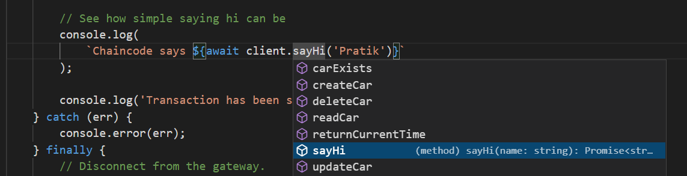

# Fabric Contract Client

Contract's should be written in a way that is clean, simple and easy to maintain.  
For this, I was a big fan of [Convector](https://github.com/hyperledger-labs/convector)  
But given Convector is not likely to be maintained or [support Fabric 2.0](https://github.com/hyperledger-labs/convector/issues/117), I needed to find and maintain a replacement which allows me to write cleaner code.

I noticed that the [`fabric-contract-api`](https://www.npmjs.com/package/fabric-contract-api) exists to write Chaincode but it has no client support.

This leverages your [fabric-contract-api](https://www.npmjs.com/package/fabric-contract-api) Chaincodes to extend and support them for usage at the Client end thus helping you write cleaner and easy to maintain code.

## Usage

Include the library first
```typescript
import ContractClient from '@pratikpc/fabric-contract-client';
```
You need to connect to the network first. This code remains same and is fairly simple.  
ChainCodeContract is the type of the contract that you have deployed. 

1. My ChainCodeContract's actual name is `CarContract`
2. So you don't even need to know the actual name.
3. The extraction is handled by the code.
4. As long as you annotate via Info parameter which you should be doing anyways
5. If not, you can pass the name of the contract as the 3rd parameter
```typescript
// Use Library
const client = ContractClient(ChainCodeContract, network);
```

```typescript
// Modern way to communicate with the library
const time = await client.returnCurrentTime();
console.log(
    'Chaincode test result: Time is ',
    time
);

// See how simple passing args can be
console.log(
    `Chaincode says ${await client.sayHi('Pratik')}`
);

console.log('Transaction has been submitted');
```
## Intellisense

When using Typescript or JavaScript, does this support Intellisense?

Yes of course it does.




## Typescript Type Checks

Yes of course.

## Older way

For those interested how it looked before this API was around

```typescript
const contract =
    network.getContract('chaincode');
console.log(
    'Using traditional approach to query Hyperledger Fabric',
    Number(
        (
            await contract.evaluateTransaction(
                'returnCurrentTime'
            )
        ).toString()
    )
);
console.log(
    'Using traditional approach to say hi to Hyperledger Fabric',
    (
        await contract.evaluateTransaction(
            'sayHi',
            'Pratik'
        )
    ).toString()
);
```

This code:- 
1. Readability is less
2. Expects every argument to be a String unlike ours
3. Needs to convert Output from String unlike ours  
Ours uses the value of your return argument
4. Needs you to know whether a transaction is submit or evaluate
5. Requires you to remember the name of the Chaincode. Mine extracts it from the Info annotation.

## Support for executing new and old way in the same code

Yes this support exists!

## What's the catch?

The catch is that we expect you to write the code with proper and corect annotations

```typescript
@Info({
    title: 'CarContract',
    DeployedChainCodeName: 'DeployedCarContract',
    description: 'A sample Car Contract'
})
export default class CarContract extends Contract {
    @Transaction(false)
    @Returns('boolean')
    // eslint-disable-next-line class-methods-use-this
    public async carExists(
        ctx: Context,
        carId: string
    ): Promise<boolean> {
        const data: Uint8Array = await ctx.stub.getState(
            carId
        );
        return !!data && data.length > 0;
    }
}
```

## Contact me

You can create an issue here or contact me [via LinkedIn](https://www.linkedin.com/in/pratik-chowdhury-889bb2183/)